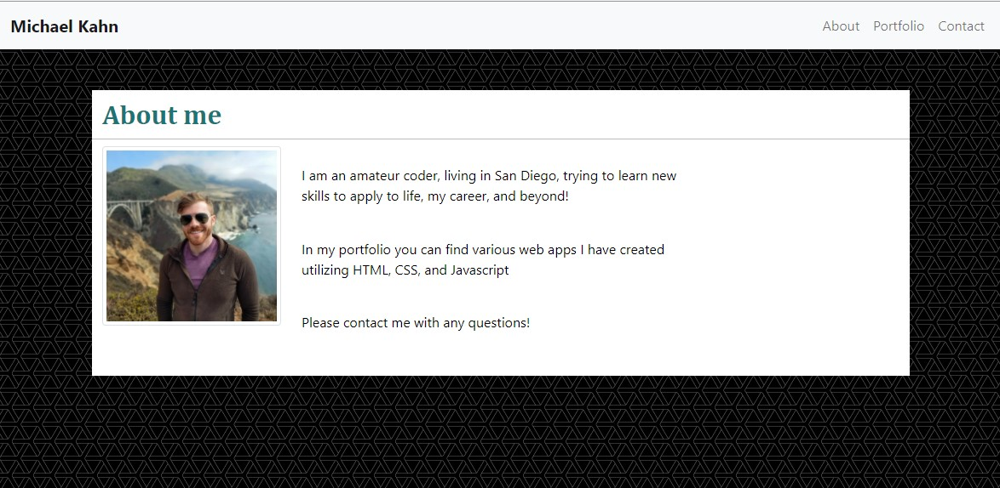
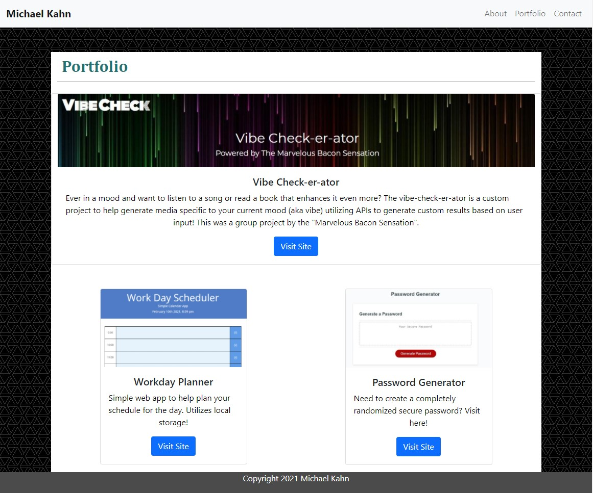
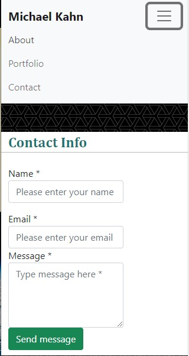

# Updated Portfolio

## Description 

This website is a basic html-css-bootsrap page that contains an "about me", "contact" and "portfolio" page. 

Originally created for assignment #2, this page has been updated to include slightly more polished code and information about projects recently created in class.

## Installation

Clone the repo at: https://github.com/mpkahn/portfolio2 and view CSS + HTML in code visualizer. 

## Usage 

Visit site at https://mpkahn.github.io/portfolio2/.
Use navbar to navigate to the three pages pages of the website. 
If website is condensed, use collapse-menu to expand navbar and select from there
Click on portfolio links to visit the sites referenced in each card

## Credits

Utilized bootstrap code and reference sheets from https://getbootstrap.com/
-JS script tags (popper) also referenced from https://getbootstrap.com/docs/5.0/getting-started/introduction/
Background texture from https://www.toptal.com/designers/subtlepatterns/
Contact-form inspired by example at : https://bootstrapious.com/p/how-to-build-a-working-bootstrap-contact-form
Some code inspired by examples at: https://www.w3schools.com/howto/howto_css_fixed_footer.asp

## License

MIT License

Copyright (c) [2021] [Michael Kahn]

Permission is hereby granted, free of charge, to any person obtaining a copy
of this software and associated documentation files (the "Software"), to deal
in the Software without restriction, including without limitation the rights
to use, copy, modify, merge, publish, distribute, sublicense, and/or sell
copies of the Software, and to permit persons to whom the Software is
furnished to do so, subject to the following conditions:

The above copyright notice and this permission notice shall be included in all
copies or substantial portions of the Software.

THE SOFTWARE IS PROVIDED "AS IS", WITHOUT WARRANTY OF ANY KIND, EXPRESS OR
IMPLIED, INCLUDING BUT NOT LIMITED TO THE WARRANTIES OF MERCHANTABILITY,
FITNESS FOR A PARTICULAR PURPOSE AND NONINFRINGEMENT. IN NO EVENT SHALL THE
AUTHORS OR COPYRIGHT HOLDERS BE LIABLE FOR ANY CLAIM, DAMAGES OR OTHER
LIABILITY, WHETHER IN AN ACTION OF CONTRACT, TORT OR OTHERWISE, ARISING FROM,
OUT OF OR IN CONNECTION WITH THE SOFTWARE OR THE USE OR OTHER DEALINGS IN THE
SOFTWARE.

## Features

Portfolio page has collaping columns as the page shrinks. 
Navigation bar also reverts to collapsible menu when page shrinks.
Footer has fixed position at bottom of the page
Thumbnail images link out to full(er) sized image
